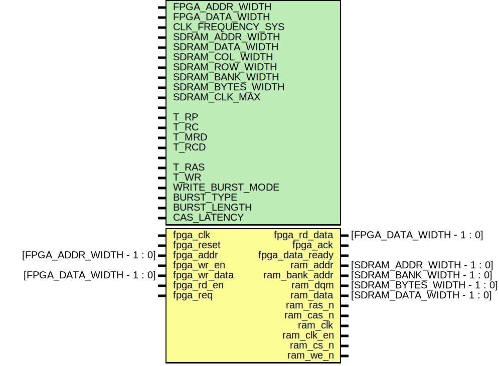

# Entity: sdram_controller

- **File**: sdram_controller.v
## _Diagram_

# Description

 ### _Module description_
 | Mode | ram_clk_en | ram_cs_n | ras_n | cas_n | ram_we_n | ram_addr[8:0] | ram_addr[9], ram_addr[11] | ram_addr[10] | ram_bank_addr[1:0] |
 | -----| ---------- | -------- | ----- | ----- | -------- | ------------- | ------------------------- | ------------ | ------------------ |
 | Activate              | 1 | 0 | 0 | 1 | 1 | Row Address | Row Address | Row Address | Bank Address |
 | Read Auto Precharge   | 1 | 0 | 1 | 0 | 1 | Column      | XX          | 1           | Bank Address |
 | Read No Precharge     | 1 | 0 | 1 | 0 | 1 | Column      | XX          | 0           | Bank Address |
 | Write Auto Precharge  | 1 | 0 | 1 | 0 | 0 | Column      | XX          | 1           | Bank Address |
 | Write No Precharge    | 1 | 0 | 1 | 0 | 0 | Column      | XX          | 0           | Bank Address |
 | Precharge All Banks   | 1 | 0 | 0 | 1 | 0 | XX          | XX          | 1           | Bank Address |
 | Precharge Bank Select | 1 | 0 | 0 | 1 | 0 | XX          | XX          | 0           | Bank Address |

### _FPGA addr_
{fpga_addr = [{name: 'bank',   bits: 2,}, {name: 'row',    bits: 12,}, {name: 'col',    bits: 9} ]}

# Generics

| Generic name      | Type | Value    | Description                                                               |
| ----------------- | ---- | -------- | ------------------------------------------------------------------------- |
| FPGA_ADDR_WIDTH   |      | 23       |                                                                           |
| FPGA_DATA_WIDTH   |      | 32       | System data width                                                         |
| CLK_FREQUENCY_SYS |      | 166      | MHz System clock                                                          |
| SDRAM_ADDR_WIDTH  |      | 12       | SDRAM address width                                                       |
| SDRAM_DATA_WIDTH  |      | 32       | SDRAM data width                                                          |
| SDRAM_COL_WIDTH   |      | 9        | SDRAM colomn width                                                        |
| SDRAM_ROW_WIDTH   |      | 12       | SDRAM row width                                                           |
| SDRAM_BANK_WIDTH  |      | 2        | SDRAM bank width                                                          |
| SDRAM_BYTES_WIDTH |      | 4        |                                                                           |
| SDRAM_CLK_MAX     |      | 166      | MHz From SDRAM datasheet                                                  |
| T_POWER_UP        |      | 200_000_000 | Power-up delay 100 us min. Set 200 ms                                  |
| T_RP              |      | 18       | Command period (PRE to ACT) delay, ns min                                 |
| T_RC              |      | 60       | Command period (REF to REF/ACT to ACT) delay, ns min                      |
| T_MRD             |      | 18       | Mode register Program Time delay, ns min                                  |
| T_RCD             |      | 18       | Active to Read/Write delay, ns min                                        |
| T_REF             |      | 64_000_000 | Refresh cycle time, ns max                                              |
| T_RAS             |      | 42       | RAS time, ns min                                                          |
| T_WR              |      | 12       | Write recovery Time or InputData to Precharge Command Delay Time          |
| WRITE_BURST_MODE  |      | 1'b1     | M9: Write Burst Mode: 0 - programmed Burst Lengtn, 1 - Single Location    |
| BURST_TYPE        |      | 1'b0     | M3:  Burst Type: 0 - Sequention, 1 - Interleaved                          |
| BURST_LENGTH      |      | 3'b000   | M2: - M0  Burst Length in  000 - 1; 001 - 2; 010 - 4; 011 - 8             |
| CAS_LATENCY       |      | 3'b010   | 166 MHz - CAS Latence 2 cycle                                             |

## Ports

| Port name       | Direction | Type                        | Description |
| --------------- | --------- | --------------------------- | ----------- |
|     FPGA ports                                                          |
| fpga_clk        | input     |                             |             |
| fpga_reset      | input     |                             |             |
| fpga_addr       | input     | [FPGA_ADDR_WIDTH   - 1 : 0] |             |
| fpga_wr_en      | input     |                             |             |
| fpga_wr_data    | input     | [FPGA_DATA_WIDTH   - 1 : 0] |             |
| fpga_rd_data    | output    | [FPGA_DATA_WIDTH   - 1 : 0] |             |
| fpga_rd_en      | input     |                             |             |
| fpga_req        | input     |                             |             |
| fpga_ack        | output    |                             |             |
| fpga_data_ready | output    |                             |             |
|     SDRAM ports                                                         |
| ram_addr        | output    | [SDRAM_ADDR_WIDTH  - 1 : 0] |             |
| ram_bank_addr   | output    | [SDRAM_BANK_WIDTH  - 1 : 0] |             |
| ram_dqm         | output    | [SDRAM_BYTES_WIDTH - 1 : 0] |             |
| ram_data        | inout     | [SDRAM_DATA_WIDTH  - 1 : 0] |             |
| ram_ras_n       | output    |                             |             |
| ram_cas_n       | output    |                             |             |
| ram_clk         | output    |                             |             |
| ram_clk_en      | output    |                             |             |
| ram_cs_n        | output    |                             |             |
| ram_we_n        | output    |                             |             |

## Signals

| Name                | Type                                                           | Description                                                        |
| ------------------- | -------------------------------------------------------------- | ------------------------------------------------------------------ |
| state               | reg                                                      [7:0] | SDRAM mode FSM States                                              |
| next_state          | reg                                                      [7:0] | SDRAM mode FSM States                                              |
| cmd                 | reg                                                      [3:0] | SDRAM control commands                                             |
| next_cmd            | reg                                                      [3:0] | SDRAM control commands                                             |
| start               | wire                                                           | control signals                                                    |
| load_mode_done      | wire                                                           |                                                                    |
| active_done         | wire                                                           |                                                                    |
| refresh_done        | wire                                                           |                                                                    |
| read_done           | wire                                                           |                                                                    |
| write_done          | wire                                                           |                                                                    |
| should_refresh      | wire                                                           |                                                                    |
| write_state_flag    | reg                                                            |                                                                    |
| oe                  | reg                                                            |                                                                    |
| fpga_data_ready_reg | reg                                      [CAS_LATENCY + 1 : 0] |                                                                    |
| wait_counter        | reg                                                   [24 : 0] | Wait counter [$clog2 (INIT_WAIT) - 1 : 0]                          |
| refresh_counter     | reg                                                   [23 : 0] | Number of row per refresh time [$clog2 (REFRESH_INTERVAL) - 1 : 0] |
| addr_reg            | reg [SDRAM_COL_WIDTH + SDRAM_ROW_WIDTH + SDRAM_BANK_WIDTH - 1 : 0] | Registers                                                      |
| data_reg            | reg                                  [FPGA_DATA_WIDTH - 1 : 0] |                                                                    |
| we_reg              | reg                                                            |                                                                    |
| rd_reg              | reg                                                            |                                                                    |
| q_reg               | reg                                   [FPGA_DATA_WIDTH - 1: 0] |                                                                    |
| col                 | wire [SDRAM_COL_WIDTH - 1 : 0]                                 | Wires for column, row and banks                                    |
| row                 | wire [SDRAM_ROW_WIDTH - 1 : 0]                                 |                                                                    |
| bank                | wire [SDRAM_BANK_WIDTH - 1 : 0]                                |                                                                    |

## Constants

| Name             | Type    | Value                                 | Description                                                                      |
| ---------------- | ------- | ------------------------------------- | -------------------------------------------------------------------------------- |
| MODE_REG         |         | {2'b00, WRITE_BURST_MODE, 2'b00, CAS_LATENCY, BURST_TYPE, BURST_LENGTH} | The value written to the mode register to configure the memory           |
| CLK_PERIOD       |         | 1.0/SDRAM_CLK_MAX * 1_000.0           | Calculate the clock period (in nanoseconds)  1/166*1000 = 6.02                   |
| INIT_WAIT        | integer | T_POWER_UP/CLK_PERIOD                 | The number of clock cycles from power-up to inicialaze SDRAM                     |
| LOAD_MODE_WAIT   | integer | T_MRD/CLK_PERIOD                      | The number of clock cycles to wait while a LOAD MODE command                     |
| ACTIVE_WAIT      | integer | T_RCD/CLK_PERIOD                      | The number of clock cycles to wait while an ACTIVE command                       |
| REFRESH_WAIT     | integer | T_RC/CLK_PERIOD                       | The number of clock cycles to wait while a REFRESH command: 10                   |
| PRECHARGE_WAIT   | integer | T_RP/CLK_PERIOD                       | The number of clock cycles to wait while a PRECHARGE command: 3                  |
| READ_WAIT        | integer | CAS_LATENCY+BURST_LENGTH              | The number of clock cycles to wait while a READ command is being executed        |
| WRITE_WAIT       | integer | BURST_LENGTH + (T_WR+T_RP)/CLK_PERIOD | The number of clock cycles to wait while a WRITE command is being executed       |
| REFRESH_INTERVAL | integer | T_REF/CLK_PERIOD - 12                 | The number of clock cycles before the memory controller starts to refresh        |

## SDRAM control FSM States 
| Name             | Code         |   										
| ---------------- | ------------ |	
| INIT             | 8'b0000_0000 |
| MODE             | 8'b0000_0001 |
| IDLE             | 8'b0000_0010 |
| REFRESH          | 8'b0000_0100 |
| ACTIVATE         | 8'b0000_1000 |
| NOP              | 8'b0001_0000 |
| READ_A           | 8'b0010_0000 | 
| WRITE_A          | 8'b0100_0000 |
| PRECHARGE        | 8'b1000_0000 |

## SDRAM command code acording to datasheet
| Command                   | Code          | ram_cs_n   | ras_n   | cas_n   | ram_we_n   |  										
| ------------------------- | ------------- | ---------- | ------- | ------- | ---------- | 	
| Device deselect           | DESLECT       | 1 | X | X | X | 											
| No operation              | NOP           | 0 | 1 | 1 | 1 |
| Burst stop                | BST           | 0 | 1 | 1 | 0 |
| Read                      | READ          | 0 | 1 | 0 | 1 |
| Read with auto precharge  | READ_PRE      | 0 | 1 | 0 | 1 |
| Write                     | WRITE         | 0 | 1 | 0 | 0 |
| Write with auto precharge | WRITE_PRE     | 0 | 1 | 0 | 0 |
| Bank activate             | ACTIVE        | 0 | 0 | 1 | 1 |
| Precharge select bank     | PRECHARGE     | 0 | 0 | 1 | 0 | 
| Precharge all banks       | PRECHARGE_ALL | 0 | 0 | 1 | 0 | 
| CBR Auto-Refresh          | REFRESH       | 0 | 0 | 0 | 1 |
| Self-Refresh              | SELF_REFRESH  | 0 | 0 | 0 | 1 |
| Mode register set         | LOAD_MODE     | 0 | 0 | 0 | 0 |
## Command codes
| Command | Code |  										
| ---------------- | ----------- |  	
| CMD_DESLECT      |  4'b1111    |
| CMD_NOP          |  4'b0111    |    
| CMD_READ_PRE     |  4'b0101    |    
| CMD_WRITE_PRE    |  4'b0100    |     
| CMD_ACTIVE       |  4'b0011    |      
| CMD_PRECHARGE    |  4'b0010    |      
| CMD_REFRESH      |  4'b0001    |      
| CMD_LOAD_MODE    |  4'b0000    |  

## Processes
- fsm_next_state: (  )
  - **Type:** always
  - **Description**
  State machine 
  Next state logic
 
- fsm_next_state_register: ( @ (posedge fpga_clk, posedge fpga_reset) )
  - **Type:** always
  - **Description**
  Next state register
 
- wait_counter_always: ( @ (posedge fpga_clk, posedge fpga_reset) )
  - **Type:** always
  - **Description**
  The wait counter is used to hold the current state 
  for a number of clock cycles
 
- update_refresh_counter: ( @ (posedge fpga_clk, posedge fpga_reset) )
  - **Type:** always
  - **Description**
  The refresh counter is used to periodically trigger a refresh operation
 
- fpga_side_reg: ( @ (posedge fpga_clk) )
  - **Type:** always
  - **Description**
  Register for FPGA side signals
 
- unnamed: ( @ (state) )
  - **Type:** always
  - **Description**
  Set SDRAM bank
 
- unnamed: ( @ (state) )
  - **Type:** always
- sdram_rd_data_reg: ( @ (posedge fpga_clk) )
  - **Type:** always
  - **Description**
  Output data
 
- fpga_data_ready_delay: ( @ (posedge fpga_clk, posedge fpga_reset) )
  - **Type:** always
  - **Description**
  fpga_data_ready signal delay for CAS delay CAS_LATENCY (2 or 3 cycles)
 
- control_data_path: ( @ (posedge fpga_clk, posedge fpga_reset) )
  - **Type:** always
