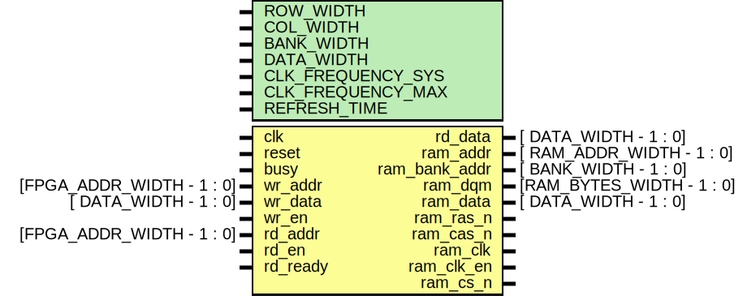

# Entity: sdram_controller

- **File**: sdram_controller.v
## Diagram

## Description

 Module description
 | Mode | ram_clk_en | ram_cs_n | ras_n | cas_n | ram_we_n | ram_addr[8:0] | ram_addr[9], ram_addr[11] | ram_addr[10] | ram_bank_addr[1:0] |
 | ----------------------- | ------------ | ---------- | ------- | ------- | ---------- | --------------- | --------------------------- | -------------- | -------------------- |
 | Activate | 1 | 0 | 0 | 1 | 1 | Row Address | Row Address | Row Address | Bank Address |
 | Read Auto Precharge | 1 | 0 | 1 | 0 | 1 | Column | XX | 1 | Bank Address |
 | Read No Precharge | 1 | 0 | 1 | 0 | 1 | Column | XX | 0 | Bank Address |
 | Write Auto Precharge | 1 | 0 | 1 | 0 | 0 | Column | XX | 1 | Bank Address |
 | Write No Precharge | 1 | 0 | 1 | 0 | 0 | Column | XX | 0 | Bank Address |
 | Precharge All Banks | 1 | 0 | 0 | 1 | 0 | XX | XX | 1 | Bank Address |
 | Precharge Bank Select | 1 | 0 | 0 | 1 | 0 | XX | XX | 0 | Bank Address |

## Generics

| Generic name      | Type | Value | Description                 |
| ----------------- | ---- | ----- | --------------------------- |
| ROW_WIDTH         |      | 12    |                             |
| COL_WIDTH         |      | 9     |                             |
| BANK_WIDTH        |      | 2     |                             |
| DATA_WIDTH        |      | 32    |                             |
| CLK_FREQUENCY_SYS |      | 166   |  MHz System clock
          |
| CLK_FREQUENCY_MAX |      | 166   |  MHz From SDRAM datasheet
  |
| REFRESH_TIME      |      | 64    |  ms Refresh Cycle Time
     |
## Ports

| Port name     | Direction | Type                      | Description  |
| ------------- | --------- | ------------------------- | ------------ |
| clk           | input     |                           |              |
| reset         | input     |                           |              |
| busy          | input     |                           |              |
| wr_addr       | input     | [FPGA_ADDR_WIDTH - 1 : 0] |  Write port  |
| wr_data       | input     | [     DATA_WIDTH - 1 : 0] |              |
| wr_en         | input     |                           |              |
| rd_addr       | input     | [FPGA_ADDR_WIDTH - 1 : 0] |  Read port   |
| rd_data       | output    | [     DATA_WIDTH - 1 : 0] |              |
| rd_en         | input     |                           |              |
| rd_ready      | input     |                           |              |
| ram_addr      | output    | [ RAM_ADDR_WIDTH - 1 : 0] |  SDRAM ports |
| ram_bank_addr | output    | [     BANK_WIDTH - 1 : 0] |              |
| ram_dqm       | output    | [RAM_BYTES_WIDTH - 1 : 0] |              |
| ram_data      | inout     | [     DATA_WIDTH - 1 : 0] |              |
| ram_ras_n     | output    |                           |              |
| ram_cas_n     | output    |                           |              |
| ram_clk       | output    |                           |              |
| ram_clk_en    | output    |                           |              |
| ram_cs_n      | output    |                           |              |
## Constants

| Name                   | Type | Value                                   | Description                                                                                                                                                                                                                                                                                                                                                                                                                                                                                                                                                                                                                                                                                                                                                                                                                                                                                                                           |
| ---------------------- | ---- | --------------------------------------- | ------------------------------------------------------------------------------------------------------------------------------------------------------------------------------------------------------------------------------------------------------------------------------------------------------------------------------------------------------------------------------------------------------------------------------------------------------------------------------------------------------------------------------------------------------------------------------------------------------------------------------------------------------------------------------------------------------------------------------------------------------------------------------------------------------------------------------------------------------------------------------------------------------------------------------------- |
| CMD_DESL               |      | 8'bX1XXXXXX                             |  | Command | Code | ram_clk_en | ram_cs_n | ras_n | cas_n | ram_we_n | ram_bank_addr[1] | ram_bank_addr[0] | ram_addr[10] | 
  | ---------------------- | ------ | ------------ | ---------- | ------- | ------- | ---------- | ------------------ | ------------------ | -------------- | 
  | Device deselect  | DESL | X | 1 | X | X | X | X | X | X | 
  | No operation  | NOP | X | 0 | 1 | 1 | 1 | X | X | X | 
  | Burst stop  | BST | X | 0 | 1 | 1 | 0 | X | X | X | 
  | Read | RD | X | 0 | 1 | 0 | 1 | X | X | 0 | 
  | Read with auto precharge | RDAR | X | 0 | 1 | 0 | 1 | X | X | 1 | 
  | Write | WR | X | 0 | 1 | 0 | 0 | X | X | 0 | 
  | Write with auto precharge | WRAR | X | 0 | 1 | 0 | 0 | X | X | 1 | 
  | Bank activate  | ACT | X | 0 | 0 | 1 | 1 | X | X | X | 
  | Precharge select bank  | PRE | X | 0 | 0 | 1 | 0 | X | X | 0 | 
  | Precharge all banks  | PALL | X | 0 | 0 | 1 | 0 | X | X | 1 | 
  |
| CMD_NOP                |      | 8'bX0111XXX                             |                                                                                                                                                                                                                                                                                                                                                                                                                                                                                                                                                                                                                                                                                                                                                                                                                                                                                                                                       |
| CMD_BST                |      | 8'bX0110XXX                             |                                                                                                                                                                                                                                                                                                                                                                                                                                                                                                                                                                                                                                                                                                                                                                                                                                                                                                                                       |
| CMD_RD                 |      | 8'bX0101XX0                             |                                                                                                                                                                                                                                                                                                                                                                                                                                                                                                                                                                                                                                                                                                                                                                                                                                                                                                                                       |
| CMD_RDAR               |      | 8'bX0101XX1                             |                                                                                                                                                                                                                                                                                                                                                                                                                                                                                                                                                                                                                                                                                                                                                                                                                                                                                                                                       |
| CMD_WR                 |      | 8'bX0100XX0                             |                                                                                                                                                                                                                                                                                                                                                                                                                                                                                                                                                                                                                                                                                                                                                                                                                                                                                                                                       |
| CMD_WRAR               |      | 8'bX0100XX1                             |                                                                                                                                                                                                                                                                                                                                                                                                                                                                                                                                                                                                                                                                                                                                                                                                                                                                                                                                       |
| CMD_ACT                |      | 8'bX0011XXX                             |                                                                                                                                                                                                                                                                                                                                                                                                                                                                                                                                                                                                                                                                                                                                                                                                                                                                                                                                       |
| CMD_PRE                |      | 8'bX0010XX0                             |                                                                                                                                                                                                                                                                                                                                                                                                                                                                                                                                                                                                                                                                                                                                                                                                                                                                                                                                       |
| CMD_PALL               |      | 8'bX0010XX1                             |                                                                                                                                                                                                                                                                                                                                                                                                                                                                                                                                                                                                                                                                                                                                                                                                                                                                                                                                       |
| CMD_REF                |      | 8'b10001XXX                             |                                                                                                                                                                                                                                                                                                                                                                                                                                                                                                                                                                                                                                                                                                                                                                                                                                                                                                                                       |
| CMD_SELF               |      | 8'b00001XXX                             |                                                                                                                                                                                                                                                                                                                                                                                                                                                                                                                                                                                                                                                                                                                                                                                                                                                                                                                                       |
| CMD_MRS                |      | 8'bX0000000                             |                                                                                                                                                                                                                                                                                                                                                                                                                                                                                                                                                                                                                                                                                                                                                                                                                                                                                                                                       |
| FPGA_ADDR_WIDTH        |      | BANK_WIDTH + ROW_WIDTH + COL_WIDTH      |  FPGA system address width
                                                                                                                                                                                                                                                                                                                                                                                                                                                                                                                                                                                                                                                                                                                                                                                                                                                                                                           |
| CYCLES_BETWEEN_REFRESH |      | CLK_FREQUENCY_SYS * REFRESH_TIME * 1000 |  System clock cycles required per refresh time
                                                                                                                                                                                                                                                                                                                                                                                                                                                                                                                                                                                                                                                                                                                                                                                                                                                                                       |
| RAM_BYTES_WIDTH        |      | $clog2 (DATA_WIDTH / 8)                 |  Number of bit needed for data byte encoding
                                                                                                                                                                                                                                                                                                                                                                                                                                                                                                                                                                                                                                                                                                                                                                                                                                                                                         |
| REFRESH_COUNT          |      | $clog2 (ROW_WIDTH)                      |  Number of row per refresh time
                                                                                                                                                                                                                                                                                                                                                                                                                                                                                                                                                                                                                                                                                                                                                                                                                                                                                                      |
| init                   |      | 4'b0000                                 |  SDRAM control FSM
  States 
                                                                                                                                                                                                                                                                                                                                                                                                                                                                                                                                                                                                                                                                                                                                                                                                                                                                                                         |
| mode                   |      | 4'b1111                                 |  SDRAM control FSM
  States 
                                                                                                                                                                                                                                                                                                                                                                                                                                                                                                                                                                                                                                                                                                                                                                                                                                                                                                         |
| idle                   |      | 4'b0011                                 |  SDRAM control FSM
  States 
                                                                                                                                                                                                                                                                                                                                                                                                                                                                                                                                                                                                                                                                                                                                                                                                                                                                                                         |
| refresh                |      | 4'b0110                                 |  SDRAM control FSM
  States 
                                                                                                                                                                                                                                                                                                                                                                                                                                                                                                                                                                                                                                                                                                                                                                                                                                                                                                         |
| activate               |      | 4'b0010                                 |  SDRAM control FSM
  States 
                                                                                                                                                                                                                                                                                                                                                                                                                                                                                                                                                                                                                                                                                                                                                                                                                                                                                                         |
| nop                    |      | 4'b0001                                 |  SDRAM control FSM
  States 
                                                                                                                                                                                                                                                                                                                                                                                                                                                                                                                                                                                                                                                                                                                                                                                                                                                                                                         |
| read                   |      | 4'b0100                                 |  SDRAM control FSM
  States 
                                                                                                                                                                                                                                                                                                                                                                                                                                                                                                                                                                                                                                                                                                                                                                                                                                                                                                         |
| read_a                 |      | 4'b0101                                 |  SDRAM control FSM
  States 
                                                                                                                                                                                                                                                                                                                                                                                                                                                                                                                                                                                                                                                                                                                                                                                                                                                                                                         |
| write                  |      | 4'b1000                                 |  SDRAM control FSM
  States 
                                                                                                                                                                                                                                                                                                                                                                                                                                                                                                                                                                                                                                                                                                                                                                                                                                                                                                         |
| write_a                |      | 4'b1001                                 |  SDRAM control FSM
  States 
                                                                                                                                                                                                                                                                                                                                                                                                                                                                                                                                                                                                                                                                                                                                                                                                                                                                                                         |
| precharge              |      | 4'b1100                                 |  SDRAM control FSM
  States 
                                                                                                                                                                                                                                                                                                                                                                                                                                                                                                                                                                                                                                                                                                                                                                                                                                                                                                         |
## Processes
- unnamed: ( @ (posedge clk or posedge reset) )
  - **Type:** always
